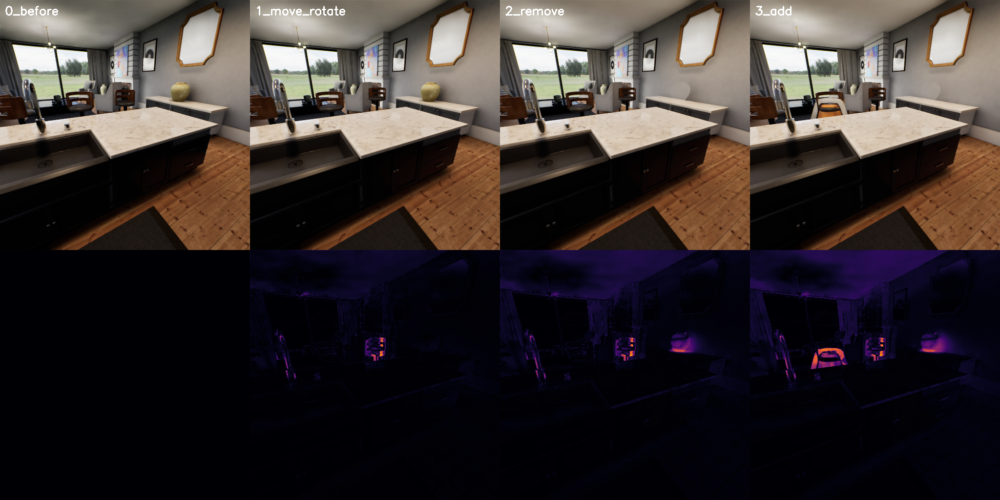

# Counterfactual intervention demo

Captures paired **factual / counterfactual observations** of the `apartment_0000` scene — the core loop
for building counterfactual datasets (record → intervene → record → diff). Built from the idioms in
`examples/render_image_dataset` and `examples/debug_draw`.

What it does, in one run against the packaged standalone executable:

1. Launches `SpearSim.app` (default map `apartment_0000`) and enumerates all scene actors
   (~95; inventory saved to `output/actor_inventory.json`).
2. Spawns `/SpContent/Blueprints/BP_CameraSensor`, aims it at a chair, initializes the
   RGB (`final_tone_curve_hdr_`) and metric-depth (`sp_depth_meters_`) capture components.
3. Captures four conditions, each as RGB PNG + colorized-depth PNG + raw depth `.npy`:
   - `0_before` — baseline
   - `1_move_rotate` — the chair teleported +60 cm and rotated +45° (`K2_SetActorLocationAndRotation`;
     note `SetMobility("Movable")` is required first because scene furniture is Static mobility)
   - `2_remove` — the nearest decor object (a vase) destroyed (`destroy_actor`)
   - `3_add` — a new chair spawned from StarterContent (`spawn_actor` + `load_object` + `SetStaticMesh`)
4. Writes diff-vs-baseline heatmaps per condition and a labeled contact sheet.



## Run it

```bash
conda activate spear-env
cp user_config.yaml.example user_config.yaml   # edit GAME_EXECUTABLE for your machine
python run.py
# outputs land in ./output/
```

## Extending to counterfactual VIDEO pairs

Wrap each condition in a frame loop (move the camera or let physics evolve with `instance.step()`),
save per-frame PNGs, and encode like `examples/render_image_multi_view` does (mp4 via the ffmpeg bundled
in `imageio_ffmpeg`). Because SPEAR's frame loop is deterministic (fixed 1/30 s delta time by default),
factual and counterfactual rollouts stay frame-aligned — only your intervention differs.

## Gotchas encoded in this example

- Getter structs (`K2_GetActorLocation/Rotation`) return **lowercase** keys (`x, y, z` / `pitch, yaw, roll`);
  setter arguments take **uppercase** (`NewLocation={"X": ...}`).
- Give the renderer a few `instance.step()` frames after every scene edit — TAA/Lumen accumulate temporally.
- Small residual diff noise comes from animated exterior (sky/foliage through windows); it is not an error.
