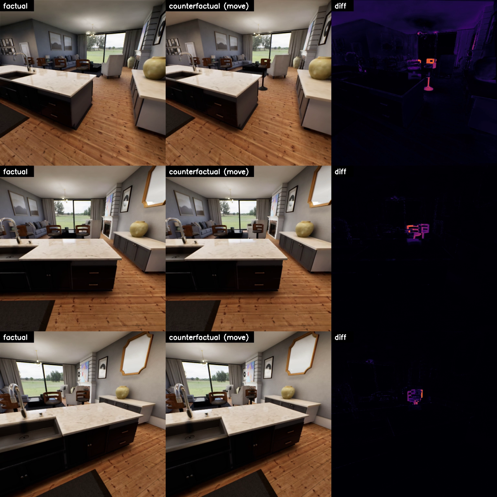

# Counterfactual intervention demo

Captures paired **factual / counterfactual observations** of the `apartment_0000` scene — the core loop
for building counterfactual datasets (record → intervene → record → diff). Built from the idioms in
`examples/render_image_dataset` and `examples/debug_draw`.

What it does, in one run against the packaged standalone executable:

1. Launches `SpearSim.app` (default map `apartment_0000`) and enumerates all scene actors
   (~95; inventory saved to `output/actor_inventory.json`).
2. Spawns `/SpContent/Blueprints/BP_CameraSensor`, aims it at a chair, initializes the
   RGB (`final_tone_curve_hdr_`) and metric-depth (`sp_depth_meters_`) capture components.
3. Captures four conditions, each as RGB PNG + colorized-depth PNG + raw depth `.npy`:
   - `0_before` — baseline
   - `1_move_rotate` — the chair teleported +60 cm and rotated +45° (`K2_SetActorLocationAndRotation`;
     note `SetMobility("Movable")` is required first because scene furniture is Static mobility)
   - `2_remove` — the nearest decor object (a vase) destroyed (`destroy_actor`)
   - `3_add` — a new chair spawned from StarterContent (`spawn_actor` + `load_object` + `SetStaticMesh`)
4. Writes diff-vs-baseline heatmaps per condition and a labeled contact sheet.


## Run it

```bash
conda activate spear-env
cp user_config.yaml.example user_config.yaml   # edit GAME_EXECUTABLE for your machine
python run.py
# outputs land in ./output/
```

## Counterfactual VIDEO pairs — `counterfactual_video.py`

`counterfactual_video.py` turns the single-frame idea above into frame-aligned **video pairs**. It renders
the same scripted camera orbit twice — once on the untouched scene ("factual") and once after a single
intervention ("counterfactual") — and writes per-rollout RGB/depth mp4s plus a labeled
`factual | counterfactual | diff` comparison video. Because SPEAR's frame loop is deterministic
(fixed 1/30 s delta time) and the camera path is scripted rather than physics-driven, the two rollouts stay
pixel-aligned everywhere except the intervention — so the diff track isolates exactly what changed.



```bash
conda activate spear-env
# uses the same user_config.yaml as above (GAME_EXECUTABLE set for your machine)
python counterfactual_video.py --intervention move   # or: remove | add
# mp4s land in ./output_video/
```

Encoding uses the ffmpeg bundled in `imageio-ffmpeg` (no system ffmpeg needed), the same as
`examples/render_image_multi_view`. A long orbit can trigger on-demand shader/PSO compilation, so the script
raises `SPEAR.INSTANCE.CLIENT_INTERNAL_TIMEOUT_SECONDS` (via `--rpc-timeout`, default 60 s) above the 2 s
default to keep those hitches from aborting the run.

## Gotchas encoded in this example

- Getter structs (`K2_GetActorLocation/Rotation`) return **lowercase** keys (`x, y, z` / `pitch, yaw, roll`);
  setter arguments take **uppercase** (`NewLocation={"X": ...}`).
- Give the renderer a few `instance.step()` frames after every scene edit — TAA/Lumen accumulate temporally.
- Small residual diff noise comes from animated exterior (sky/foliage through windows); it is not an error.
